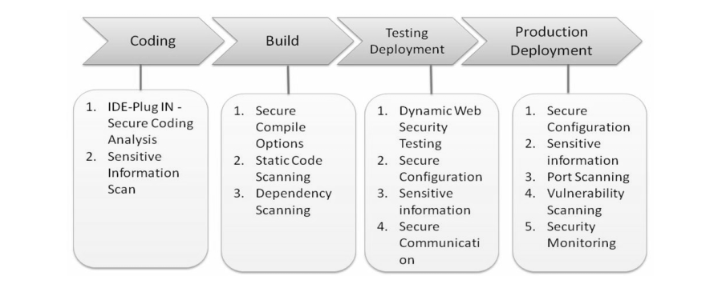
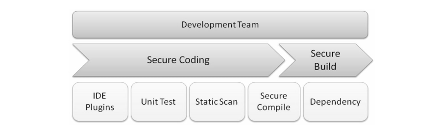

# Security automation

Most development activities include coding, compiling/building, testing, and deployment. In the coding stage, IDE plugins to do security source code analysis can be used. In the build stage, scanning for the secure hardened compiling options and the known vulnerabilities of the dependency components, as well as the secure source code for the whole project.

With the build ready and installed on the staging environment, more security scanning can be performed, such as dynamic web security testing by OWASP ZAP, infrastructure configuration security, and secure communication protocols. Production deployment can also be scanned regularly, and this will be more focused on security monitoring instead of the source code or dynamic web security testing.

## Development

For secure coding, an IDE plugin to do code scanning can be used, or security unit testing and running a static code scan of the whole project. For the secure build delivery, the compiler options must be checked to have been configured properly and all the dependency components must be reviewed for known vulnerabilities.

Advantages of using IDE plugins for automated security code review is that the tools can provide recommendations for fixes during coding. This can reduce time spent on code review and fixing security defects that can not be detected by blackbox testing. But this kind of static code scanning may introduce some annoying false positives, and developers may ignore or forget to use the IDE plugins to do static secure code analysis.

There may be occasions where peer code review and a team collaboration portal is required. 

* [Gerrit](https://www.gerritcodereview.com/) provides a web-based UI code review for the GIT source code.
* [Phabricator](https://www.phacility.com/) integrates not code review tools and bug tracking.

Developers may choose to not fully apply IDE code-scanning plugins for secure code analysis. In that case, integrating static code analysis into the CI framework can help enforce secure code scanning for all projects.

Secure compiler configuration means enabling the compile-time defenses against memory corruption issues to execute unexpected exploit code. These mitigations may include RELRO, address space layout randomization (ASLR), NoExecute (NX), stack canaries, and position-independent executables (PIE). These secure compiler configurations are best done during development.

Known vulnerabilities in third-party components or dependencies are part of the OWASP Top 10 List of Using Components with Known Vulnerabilities. Known vulnerable components can be identified at an early development stage.

## Web testing in proactive/proxy mode

Dynamic web testing tools, such as OWASP ZAP, Arachni, Wapiti and W3af, provide two modes of security testing: proactive and proxy. 

* Proactive mode means the testing tools are launched and test the web services directly. The tester decides the types of security testing (such as XSS or SQLi) of the target web service. With this kind of testing it is possible to miss certain permission-required web pages, or web pages that may require the right order of page visits.
* Proxy mode, which can also be understood as MITM, means that the security testing tool is running as a proxy and intercepting traffic between the browser client and the target web services. In proxy mode, potential security vulnerability issues are detected based on the intercepted traffic.
