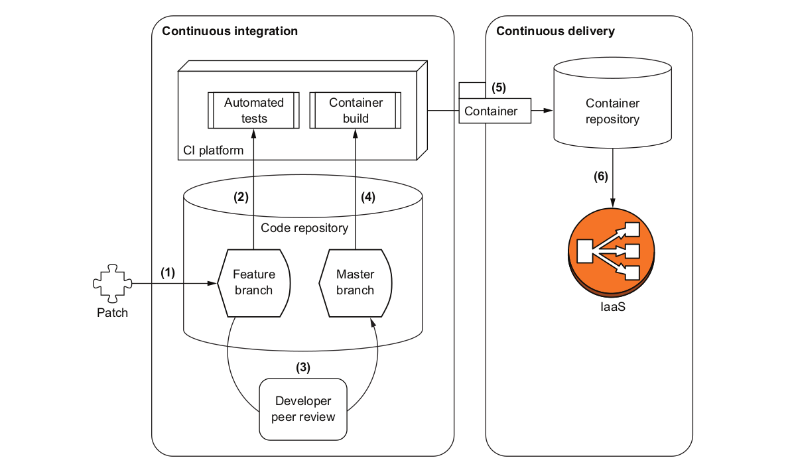

# Barebones pipeline

This barebones pipeline is composed of six steps:

1. A developer writes a patch and publishes it to a feature branch of the code repository.
2. Automated tests are run against the application.
3. A peer of the developer reviews the patch and merges it into the master branch of the code repository.
4. A new version of the application is automatically built and packaged into a container.
5. The container is published to a public registry.
6. The production infrastructure retrieves the container from the registry and deploys it.



Minimal toolkit:

* A source code repository: Bitbucket, Beanstalk, GitHub, GitLab, SourceForge, etc. This first one is on GitHub and hosts the source code of the application, and the scripts that simplify the setup of the infrastructure.
* A CI platform: Travis CI, CircleCI, Jenkins, GitLab, etc. CircleCI integrates easily with GitHub and allows SSH access to build instances, which is handy for debugging build steps. The concept of using a CI platform to test and build an application is general and can easily be reproduced in other CI platforms.
* A container repository: Docker and Docker Hub are still the standard choice.
* An IaaS provider: Google Cloud Platform and Amazon Web Services (AWS) are the two most popular IaaS providers at the moment, besides solutions like Kubernetes or OpenStack to implement a layer of management on top of hardware (Kubernetes can also be used on top of EC2 instances in AWS).

Even traditional infrastructures can benefit from modern DevOps techniques by building the exact same CI/CD/IaaS pipeline third-party tools provide, only internally. When changing technologies, the tools and terminology change, but the overall concepts, particularly the security ones, remain the same.

## The config.yaml

```text
version: 2
jobs:

```

Configure a working directory to build the Docker container of the application:
```text
 build:
  # Variable expansion in working_directory not supported at this time
  # You will need to modify the code below to reflect your github account/repo setup
  working_directory: /go/src/github.com/ninabarzh/invoicer-chapter2
```

The environment the job will run on:
```text  
  docker:
   - image: circleci/golang:1.10
  steps:
   - checkout
   - setup_remote_docker

   - run: 
      name: Setup environment
      command: |
       gb="/src/github.com/${CIRCLE_PROJECT_USERNAME}";
       if [ ${CIRCLE_PROJECT_USERNAME} == 'Securing-DevOps' ]; then
         dr="securingdevops"
       else
         dr=$DOCKER_USER
```

Environment variables to build the application:
```text
       fi
       cat >> $BASH_ENV << EOF
       export GOPATH_HEAD="$(echo ${GOPATH}|cut -d ':' -f 1)"
       export GOPATH_BASE="$(echo ${GOPATH}|cut -d ':' -f 1)${gb}"
       export DOCKER_REPO="$dr"
       EOF
   - run: mkdir -p "${GOPATH_BASE}"
   - run: mkdir -p "${GOPATH_HEAD}/bin"
```

Run the unit tests of the application:
```text       
   - run:
      name: Testing application
      command: |
          go test \
          github.com/${CIRCLE_PROJECT_USERNAME}/${CIRCLE_PROJECT_REPONAME}

   - deploy:
```

If changes are applied to the master branch, build the Docker container of the application:
```text
       command: |
         if [ "${CIRCLE_BRANCH}" == "master" ]; then
```

Log into the Docker Hub service:
```text         
           docker login -u ${DOCKER_USER} -p ${DOCKER_PASS};
```

Build the application binary:
```text
           go install --ldflags '-extldflags "-static"' \
           github.com/${CIRCLE_PROJECT_USERNAME}/${CIRCLE_PROJECT_REPONAME};
           mkdir bin;
           cp "$GOPATH_HEAD/bin/${CIRCLE_PROJECT_REPONAME}" bin/invoicer;
```

Build a container of the application using a Dockerfile:
```text
           docker build -t ${DOCKER_REPO}/${CIRCLE_PROJECT_REPONAME} .;
           docker images --no-trunc | awk '/^app/ {print $3}' | \
             sudo tee $CIRCLE_ARTIFACTS/docker-image-shasum256.txt;
```

Push the container to Docker Hub:
```text
           docker push ${DOCKER_REPO}/${CIRCLE_PROJECT_REPONAME};
         fi
```
