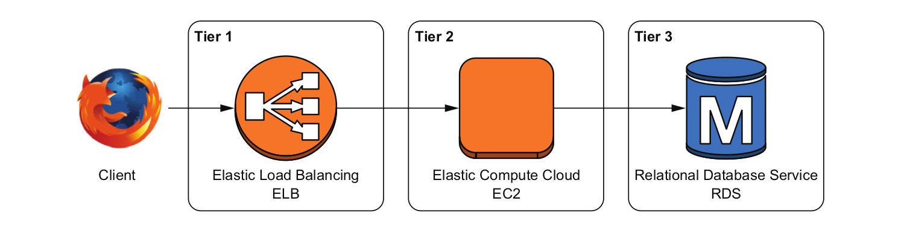

# Barebones pipeline

This barebones pipeline is composed of six steps:

1. A developer writes a patch and publishes it to a feature branch of the code repository.
2. Automated tests are run against the application.
3. A peer of the developer reviews the patch and merges it into the master branch of the code repository.
4. A new version of the application is automatically built and packaged into a container.
5. The container is published to a public registry.
6. The production infrastructure retrieves the container from the registry and deploys it.


Minimal toolkit:

* A source code repository: Bitbucket, Beanstalk, GitHub, GitLab, SourceForge, etc. This first barebones pipeline is on GitHub and hosts the source code of the application, and the scripts that simplify the setup of the infrastructure.
* A CI platform: Travis CI, CircleCI, Jenkins, GitLab, etc. CircleCI integrates easily with GitHub and allows SSH access to build instances, which is handy for debugging build steps. The concept of using a CI platform to test and build an application is general and can easily be reproduced in other CI platforms.
* A container repository: Docker and Docker Hub are still the standard choice.
* An IaaS provider: Google Cloud Platform and Amazon Web Services (AWS) are the two most popular IaaS providers at the moment, besides solutions like Kubernetes or OpenStack to implement a layer of management on top of hardware (Kubernetes can also be used on top of EC2 instances in AWS).

Even traditional infrastructures can benefit from modern DevOps techniques by building the exact same CI/CD/IaaS pipeline third-party tools provide, only internally. When changing technologies, the tools and terminology change, but the overall concepts, particularly the security ones, remain the same.

## GitHub

### Example config.yaml

```text
version: 2
jobs:
```

Configure a working directory to build the Docker container of the application:
```text
 build:
  # Variable expansion in working_directory not supported at this time
  # You will need to modify the code below to reflect your github account/repo setup
  working_directory: /go/src/github.com/ninabarzh/invoicer-chapter2
```

The environment the job will run on:
```text  
  docker:
   - image: circleci/golang:1.10
  steps:
   - checkout
   - setup_remote_docker

   - run: 
      name: Setup environment
      command: |
       gb="/src/github.com/${CIRCLE_PROJECT_USERNAME}";
       if [ ${CIRCLE_PROJECT_USERNAME} == 'Securing-DevOps' ]; then
         dr="securingdevops"
       else
         dr=$DOCKER_USER
```

Environment variables to build the application:
```text
       fi
       cat >> $BASH_ENV << EOF
       export GOPATH_HEAD="$(echo ${GOPATH}|cut -d ':' -f 1)"
       export GOPATH_BASE="$(echo ${GOPATH}|cut -d ':' -f 1)${gb}"
       export DOCKER_REPO="$dr"
       EOF
   - run: mkdir -p "${GOPATH_BASE}"
   - run: mkdir -p "${GOPATH_HEAD}/bin"
```

Run the unit tests of the application:
```text       
   - run:
      name: Testing application
      command: |
          go test \
          github.com/${CIRCLE_PROJECT_USERNAME}/${CIRCLE_PROJECT_REPONAME}

   - deploy:
```

If changes are applied to the master branch, build the Docker container of the application:
```text
       command: |
         if [ "${CIRCLE_BRANCH}" == "master" ]; then
```

Log into the Docker Hub service:
```text         
           docker login -u ${DOCKER_USER} -p ${DOCKER_PASS};
```

Compile the source code of the invoicer into a static binary, copy it into bin/invoicer:
```text
           go install --ldflags '-extldflags "-static"' \
           github.com/${CIRCLE_PROJECT_USERNAME}/${CIRCLE_PROJECT_REPONAME};
           mkdir bin;
           cp "$GOPATH_HEAD/bin/${CIRCLE_PROJECT_REPONAME}" bin/invoicer;
```

Create the invoicer container via the docker `build` command:
```text
           docker build -t ${DOCKER_REPO}/${CIRCLE_PROJECT_REPONAME} .;
           docker images --no-trunc | awk '/^app/ {print $3}' | \
             sudo tee $CIRCLE_ARTIFACTS/docker-image-shasum256.txt;
```

Push the container to Docker Hub:
```text
           docker push ${DOCKER_REPO}/${CIRCLE_PROJECT_REPONAME};
         fi
```

### Example Dockerfile

```text
FROM golang:latest
```

Create a group and user called `app` which is then used by the `USER` directive to execute your application:
```text
RUN addgroup --gid 10001 app
RUN adduser --gid 10001 --uid 10001 \
    --home /app --shell /sbin/nologin \
    --disabled-password app

RUN mkdir /app/statics/
ADD statics /app/statics/
```

Take the local file from `bin/invoicer` (a path relative to where the build operation runs) and put it into `/app/invoicer` in the container:
```text
COPY bin/invoicer /app/invoicer
USER app
```

Run the invoicer application when the container starts and allow outsiders to talk to its port, `8080`:
```text
EXPOSE 8080
WORKDIR /app
ENTRYPOINT /app/invoicer
```

## CircleCI

1. Sign up for CircleCI with your GitHub account.
2. Allow access.
2. Build the invoicer. It will fail, because Docker Hub is not set up yet.

### Webhook

Every time GitHub needs to notify CircleCI of a change, GitHub posts a notification to https://circleci.com/hooks/github. CircleCI receives the notification and triggers a build at the invoicer.


GitHub has a sophisticated permission model allowing users to delegate fine-grained permissions to third-party applications. Yet, CI platforms want read and write access to all the repositories of a user. Rather than using a highly privileged user to integrate with a CI platform, use a low-privilege account and keep the accesses under control.

## Docker Hub

1. Create an account
2. Enter the necessary environment variables in CircleCI
3. Build the invoicer again. If all is okay, now it succeeds.

## Production infrastructure

A common pattern in web applications is the three-tier architecture:



* The first tier handles incoming HTTP requests from clients (web browsers or client applications). Caching and load balancing can be performed at this level. Elastic Load Balancing (ELB) is an AWS-managed service that receives traffic from internet clients and distributes it to applications. The main goal of ELB is to allow applications to augment and reduce the number of servers as needed without touching the frontend of the service. ELB also provides SSL/TLS termination to handle HTTPS in applications easily.
* The second tier processes requests and builds responses. This is typically where the core of the application lives. An Elastic Compute Cloud (EC2) instance is nothing more than a virtual machine (VM) that runs an operating system (OS). The base infrastructure of EC2 is managed by AWS, and only the system on the VM, not the hypervisor or network underneath it, is accessible to the operator.
* The third tier is the database and other backends that store data for the application. Relational Database Service (RDS) provides MySQL, PostgreSQL, and Oracle databases managed entirely by AWS, allowing the DevOps team to focus on the data and not management of the database servers.


