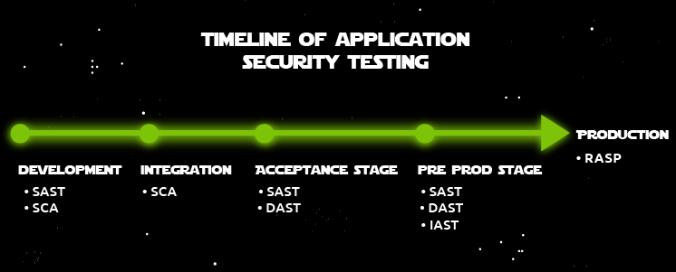

# Security-testing plan and practices

A security assessment plays a primary role in achieving security in SDLC and should be implemented in all phases where possible. Security testing assesses a system, software or web application for vulnerabilities and other attack vectors. Because they test from a holistic point of view of the application, they are usually carried out at the end of the SDLC, in the Operations and Maintenance phase, once the version has included all the working components and updates. There are two types of assessments: Penetration Testing and Vulnerability Assessment. Usually, a company employs and authorises external security testers to attempt to break into a company’s network and systems legally.

## Vulnerability assessment

Vulnerability Assessments focus on ***finding vulnerabilities***, but do not validate them or simulate the findings to prove they are exploitable in reality. Typically, automated tools run against an organisation's network and systems. Examples of tools: are OpenVAS, Nessus (Tenable), and ISS Scanner. These scanners probe ports and services on systems across various systems and IP Addresses. Other activities include checking service versions against a database of vulnerabilities affecting said version. The result is a report with a list of vulnerabilities usually found, with an automated threat level severity classification, e.g., High/Medium/Low or an assigned CVSS score.

## Penetration testing

Pentesting includes Vulnerability Testing but goes more in-depth. It is extended by testing/validating of vulnerabilities, quantifying risks and attempting to penetrate systems. For example, trying to escalate privileges after a vulnerability is found, some vulnerabilities can be a lower risk but can be used as leverage to cause more damage. The tester can provide a thorough report with suggested countermeasures to mitigate the vulnerabilities. This makes it easier to understand the threats by demonstrating the actual risk, for example, recovering an employee password by exploiting the mentioned vulnerability.

## Pros and Cons

### Vulnerability assessment

| Pros                                                          | Cons                                                                                                                                                   |
|:--------------------------------------------------------------|:-------------------------------------------------------------------------------------------------------------------------------------------------------|
| Suitable for quickly identifying potential vulnerabilities | Can produce a large number of reports                                                                                                                  |
| Part of the Penetration Test                                  | Quality depends on the tool used                                                                                                                       |
| Better for Budget, cheaper than Pentests                      | Real-life scenarios for vulnerabilities are not considered  (it could be behind a proxy or only exploitable with social engineering/credentials) |
|                                                               | The low-risk vulnerability may be used as part of a more powerful attack.                                                                           |

### Penetration testing

| Pros                                                                             | Cons                                                        |
|:---------------------------------------------------------------------------------|:------------------------------------------------------------|
| Tester shows organisations what an attacker could do.                         | Very Expensive                                              |
| How any vulnerabilities could be used against it by attackers – the real risk | Requires extensive planning and time to carry out the tests |
| Can be shown to the customer                                                     |                                                             |
	

## Secure code review & analysis

According to research conducted by Verizon in 2020 on Data Breaches, 43% of breaches were attacks on web applications, 
while some other security breaches resulted from some vulnerabilities in web applications. Implementing a secure code 
review in the phases of an SDLC, especially during the implementation phase, will increase the resilience and security 
of the product without bearing any additional cost for future patches. 

Secure code review is defined as a measure where the code itself is verified and validated to ensure vulnerabilities 
that are found can be mitigated and removed to avoid vulnerabilities and flaws. Reviewing code is a crucial step in 
the SDLC for developers. It prevents any setbacks on the release and issues exposed to the users. The cost of the 
project itself and the effort put in is proportional and cheaper in the long run than the cost of applying code 
reviews and analysis. By implementing this approach, the organisation will also be compliant with the standards 
set by government bodies and certifications. 

Code review can be done manually or automated. A manual code review is where an expert analyses and checks the source 
code by going line by line to identify vulnerabilities. Therefore, a high-quality manual code review requires the 
expert to communicate with the software developers to get hold of the purpose and functionalities of the application. 
The analysis output will then be reported to the developers if there is a need for bug fixing. 

## Code analysis

Static analysis examines the source code without executing the program. In contrast, Dynamic analysis looks at the 
source code when the program is running, static analysis detects bugs at the implementation level, and dynamic 
analysis detects errors during program runtime. Automated Static Application Security Testing (SAST) automatically 
analyses and checks the source code. 

### SAST

SAST means Static Application Security Testing, a white box testing method that directly analyses the source code.

Many people tend to develop an application that could automate or execute processes quickly and improve performance 
and user experience, thereby forgetting the negative impact an application that lacks security could cause. 

Because the test is done before an application is live and running. SAST can even help detect vulnerabilities in an 
application before the code is merged or integrated into the software if added as part of the SDLC development phase.

### SCA

Another type of testing goes hand in hand with SAST, Software Composition Analysis (SCA). SCA is used to scan dependencies for security vulnerabilities, helping development teams track and analyse any open-source component brought into a project. SCA is now an essential pillar in security testing as modern applications are increasingly composed of open-source code. Nowadays, one of the biggest challenges developer teams have is ensuring their codebase is secure as applications are assembled from different building blocks. 

### DAST

DAST means Dynamic Application Security Testing, a black-box testing method that finds vulnerabilities at runtime. DAST is a tool to scan any web application to find security vulnerabilities. This tool is used to detect vulnerabilities inside a web application that has been deployed to production. DAST tools will always send alerts to the security team assigned for immediate remediation.

DAST works by simulating automated attacks on an application, mimicking a malicious attacker. The goal is to find unexpected outcomes or results that attackers could use to compromise an application. Since DAST tools don't have internal information about the application or the source code, they attack just as an external hacker would—with the same limited knowledge and information about the application.

DAST is a tool that can be integrated very early into the software development lifecycle. Its focus is to help organisations reduce and protect against the risk that application vulnerabilities could cause. It is very different from SAST because DAST uses the Black Box Testing Methodology; it conducts its vulnerability assessment outside as it does not have access to the application source code. DAST is typically used during the testing phase of SDLC.

### IAST

IAST means Interactive Application Security Testing that analyses code for security vulnerabilities while the app is running. It is usually deployed side by side with the main application on the application server. IAST is an application security tool designed for web and mobile applications to detect and report issues even while running. Before someone can fully comprehend IAST's understanding, the person must know what SAST and DAST mean. IAST was developed to stop all the limitations in both SAST and DAST. It uses the Grey Box Testing Methodology.

IAST testing occurs in real-time, just like DAST, while the application runs in the staging environment. IAST can identify the line of code causing security issues and quickly inform the developer for immediate remediation. IAST checks the source code similar to SAST, but at the post-build stage, unlike SAST, which occurs during development. 

IAST agents are typically deployed on the application servers. When the DAST scanner performs its work by reporting a vulnerability, the deployed IAST agent will now return a line number of the issue from the source code. 

During functional testing, the agent studies every pattern that a data transfer inside the application follows, regardless of whether it's dangerous. For example, if data is coming from a user and the user wants to perform an SQL Injection on the application by appending an SQL query to a request, the request will be flagged as dangerous.

### RASP

RASP stands for Runtime Application Self Protection. RASP is a runtime application integrated into an application to analyse inward and outward traffic and end-user behavioural patterns to prevent security attacks. This tool is different from the other tools as RASP is used after product release, making it a more security-focused tool when compared to the others that are known for testing.

RASP is deployed to a web or application server next to the main application while running to monitor and analyse the inward and outward traffic behaviour. Immediately once an issue is found, RASP will send alerts to the security team and immediately block access to the individual making a request. When you deploy RASP, it will secure the whole application against different attacks. It does not just wait or try to rely only on specific signatures of some known vulnerabilities.

RASP is a complete solution that observes every detail of different attacks on your application and knows your application behaviour.

## Choosing tools

SAST, DAST, and IAST are tools that complement each other. 

* A key strength of DAST is that it identifies runtime issues—weaknesses that aren't discoverable when an application 
isn't running.
* SAST is excellent at identifying vulnerabilities while code is being written.
* Additionally, DAST looks at how an application responds to an attack, providing helpful insight into how likely it 
would be for that vulnerability to be manipulated.
* IAST enables DevSecOps and supports continuous testing, monitoring, assessment, and validation in real-time. IAST 
helps prioritise and alert on vital critical risks, as defined by business goals and application security needs. 

Security experts always support using two or more of these tools to ensure better coverage, which will lower the risk 
of vulnerabilities in production. Ensure you fit these tools to the way engineers push code and interact with the 
pipeline; watch out for integrations and focus on providing support and education vs being a blocker. 

For example, if choosing SAST, you can integrate it when engineers push code, and they can get feedback on the PR 
before merging.

## When and where?

SAST is a static approach; there is no need for a running application. Therefore, SAST can be implemented in the 
earliest development stages. 

SCA typically work best for Identifying open source components, like packages via dependencies. It is also beneficial 
for identifying open-source licenses being used, especially from a legal risk perspective. Because of this, you can 
implement governance and control by enforcing security and license policies across the different stages of SDLC.

DAST relies on the execution of the application, so integrating it in the pipeline is not as straightforward as 
SAST. DAST is typically implemented after the acceptance stage of the code and pre-production stage. This is 
where the application starts running in testing environments (e.g. sandbox/staging) similar to IAST. 

DAST and IAST reside on the far right of the pipeline because the execution of the application is required for DAST 
tools to do their work. This can become quite time-consuming, significantly if your application has grown over time. 

RASP helps uncover third-party packages and associated vulnerabilities at runtime, more effectively enabling 
developers to prioritise the remediation and mitigation of their highest pressing vulnerabilities. This is usually 
enabled in the production stage as security vulnerabilities are evaluated during the runtime of the application.

