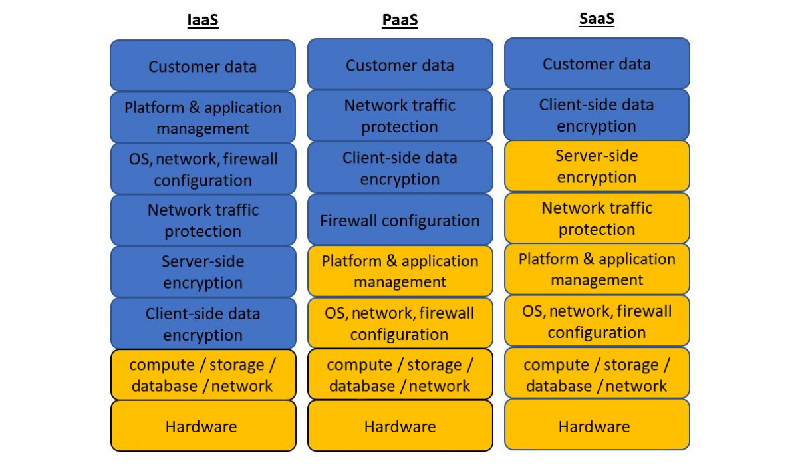
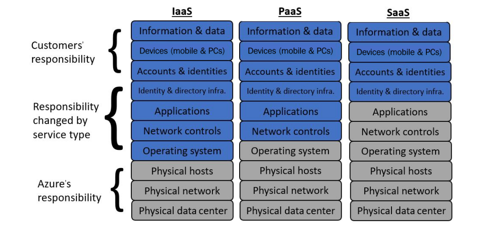
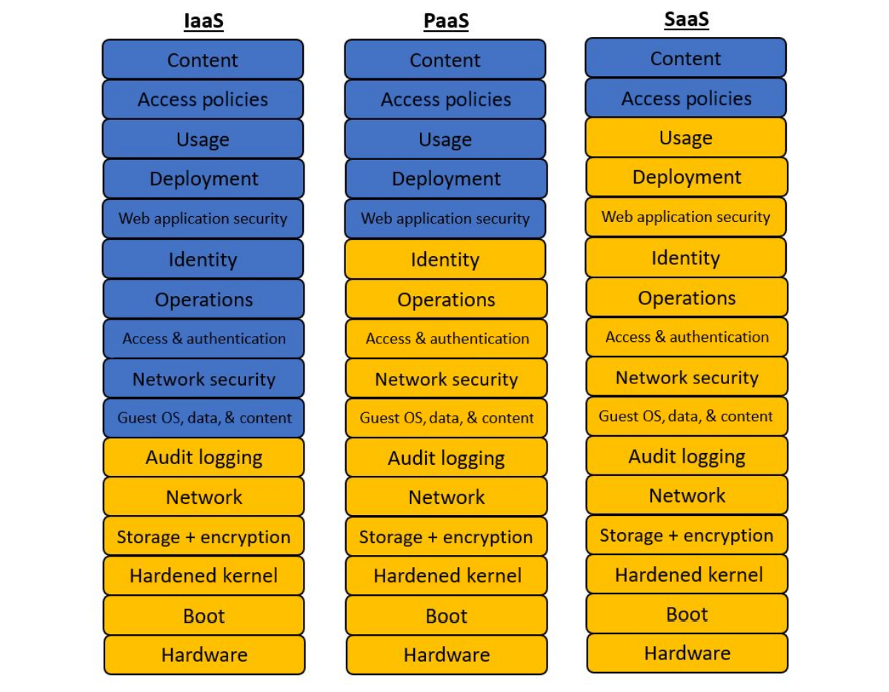

# Shared responsibility

The shared responsibility model tries to draw a line between the cloud provider and the customer's responsibilities regarding security. The cloud provider is always responsible for the lower layers – from the physical security of their data centers, through networking, storage, host servers, and the virtualisation layers. Above the virtualisation layer is where the responsibility begins to change, depending on service and cloud provider.

## AWS

## Azure

## GCP

