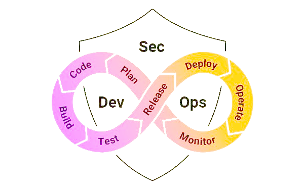

# The story sofar

Understanding how things have improved over the years and their impact on the security industry.

## DevOps

In 2008, a conversation between Andrew Clay and Patrick Debois led to something quite revolutionary. While discussing the drawbacks of Agile, DevOps was born. After an event in Belgium the following year called "DevOpsDays," DevOps became the next buzzword, and its popularity increased.

DevOps is quite different from other methodologies because it focuses on driving  "cultural change" to increase efficiency. It attempts to unite the magic of all teams working on a project, using integration and automation. With these ingredients, you get a cross-integration across all departments, QA+sysadmins+developers. 

For example, ensuring developers can now be involved in deployment and sysadmins can now write scripts, QA can figure out how to fix flaws vs constantly testing for functionality. By introducing automation and integration of systems, these engineers can now have the same visibility at all times and interact accordingly. We will dive more into how DevOps does this in the latter rooms as we talk about pipelines, automation, Continuous Integration and Continuous Delivery (CI/CD).

DevOps builds a philosophy that emphasises building trust and better liaising between developers and other teams (sysadmins, QA, etc.). This helps the organisation align technological projects to business requirements, increasing the impact and value to the business as projects become more efficient and prioritised accordingly. Changes rolled out are usually small and reversible, visible to all teams involved. This ensures better contribution and communication that helps with the pace and an increased competency when delivering work.

## TL;DR

Development infrastructure can be fully automated and operate on a self-service basis:

* Developers can provide resources to public clouds without depending on IT to provision infrastructure, which in the past led to weeks to months of delays.
* Continuous integration and deployment (CI/CD) processes automatically set up testing, staging, and production environments in the cloud or on-premises. They can be decommissioned, scaled, or re-configured as needed.
* Infrastructure-as-Code (IaC) is widely used to deploy environments declaratively*, using tools like Terraform and Vagrant.
* Organisations can now provision containerised workloads dynamically using automated, adaptive processes.
* The declarative approach requires that users specify the end state of the infrastructure - for example, deploy these machines in a running state directly into an environment, automating the configuration choices throughout the workflow. The software builds it and releases it with no human interaction.

The imperative/procedural approach takes action to configure systems in a series of actionable steps. For example, you might declare to deploy a new version of the software and automate a series of steps to get a deployment-ready state. You choose when to apply those changes at the end by adding a "gate" this gate could be a button to release the changes, e.g. "deploy changes" button, after all the automated checks and new configurations pass.

In such a workflow, even a tiny problem could create a mess. Moreover, as the number of new releases increases (the actual case), the whole matter may turn disastrous. Things would surely go out of hand with an issue still unresolved and plenty of features scheduled to be released.

## The infinite loop

DevOps is visualised as an infinite loop, describing all the comprising phases:

1. CI/ CD – Continuous Integration and Continuous Deployment (CI/CD) deals with the frequent merging of code and adding testing in an automated manner to perform checks as new code is pushed and merged. We can test code as we push and merge thanks to a new dynamic and routine in deployment, which takes the form of minor code changes systematically and routinely. Thanks to this change in dynamic, CI/CD helps detect bugs early and decreases the effort of maintaining modular code massively, which introduces reliable rollbacks of versions/code. 
2. INFRASTRUCTURE AS CODE (IaC) – a way to manage and provision infrastructure through code and automation. Thanks to this approach, we can reuse code used to deploy infrastructure (for example, cloud instances), which helps inconsistent resource creation and management. Standard tools for IaC are terraform, vagrant, etc. We will use these tools further in the pathway as we experiment with IaC security. 
3. CONFIGURATION MANAGEMENT – This is where the state of infrastructure is managed constantly and applying changes efficiently, making it more maintainable. Thanks to this, lots of time is saved, and more visibility into how infrastructure is configured. You can use IaC for configuration management. 
4. ORCHESTRATION – Orchestration is the automation of workflows. It helps achieve stability; for example, by automating the planning of resources, we can have fast responses whenever there is a problem (e.g., health checks failing); this can be achieved thanks to monitoring. 
5. MONITORING – focuses on collecting data about the performance and stability of services and infrastructure. This enables faster recovery, helps with cross-team visibility, provides more data to analyze for better root-cause analysis, and also generates an automated response, as mentioned earlier. 
6. MICROSERVICES – An architecture that breaks an application into many small services. This has several benefits, like flexibility if there is a need to scale, reduced complexity, and more options for choosing technology across microservices. We will look at these in more detail in the DevSecOps pathway.

## DevSecOps

Security can supposedly be easily integrated because of the visibility and flexibility that DevOps introduces. "Shifting Left" means that DevOps teams focus on instilling security from the earliest stages in the development lifecycle and introducing a more collaborative culture between development and security.

Since security can now be introduced early, risks are reduced massively. In the past, you would find out about security flaws and bugs at the very late stages, even in production. They are leading to stress, rollbacks, and economic losses. Integrating code analysis tools and automated tests earlier in the process can now identify these security flaws during early development.

## Shifting left

In the past, security testing was implemented at the end of the development cycle. As the industry evolved and security functions were introduced, security teams would perform various analyses and security testing in the final stages of the lifecycle.

Depending on the results of security testing, it would either permit the application to proceed for deployment into production or reject the application and pass it back to developers for remediating the flaws identified. This resulted in long delays in development and friction between teams.

Implementing security measures during all stages of the development lifecycle (shifting left) rather than at the end of the cycle will ensure the software is designed with security best practices built in. By detecting security flaws early in development, remediation costs are lower, and there would be no need to roll back changes as they are being addressed on time. This reduces cost, builds trust, and improves the security and quality of the product.

## Resources

* [History of DevOps](https://www.appknox.com/blog/history-of-devops)
* [Devopedia: Shift Left](https://devopedia.org/shift-left)
* [3 DevSecOps success stories](https://www.csoonline.com/article/3439737/3-devsecops-success-stories.html)
