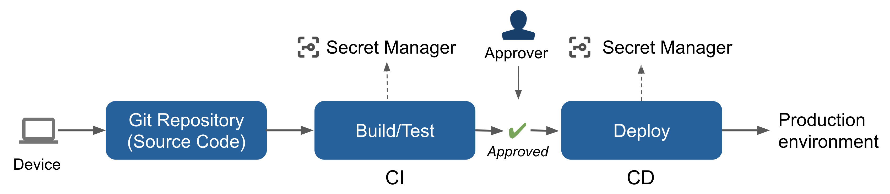
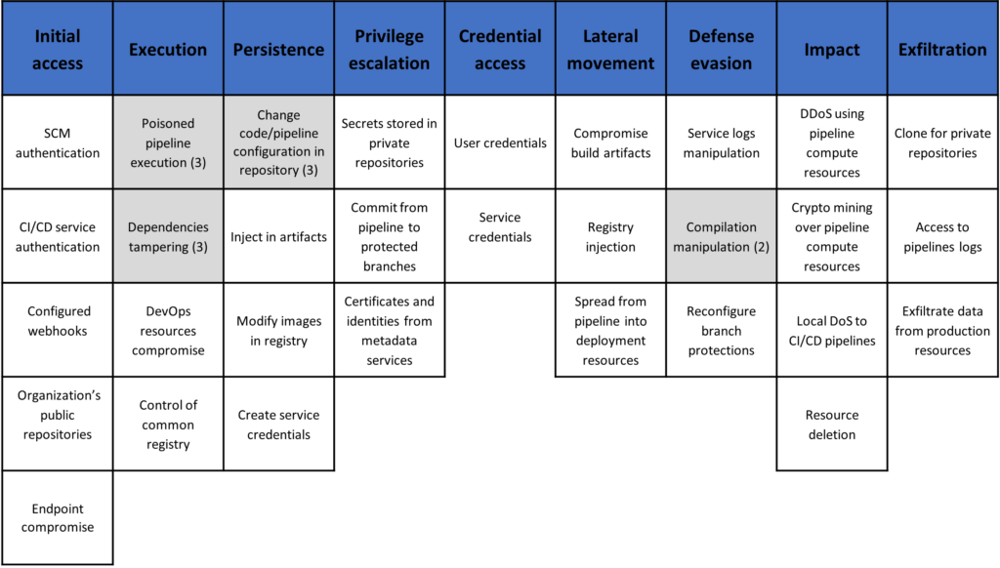
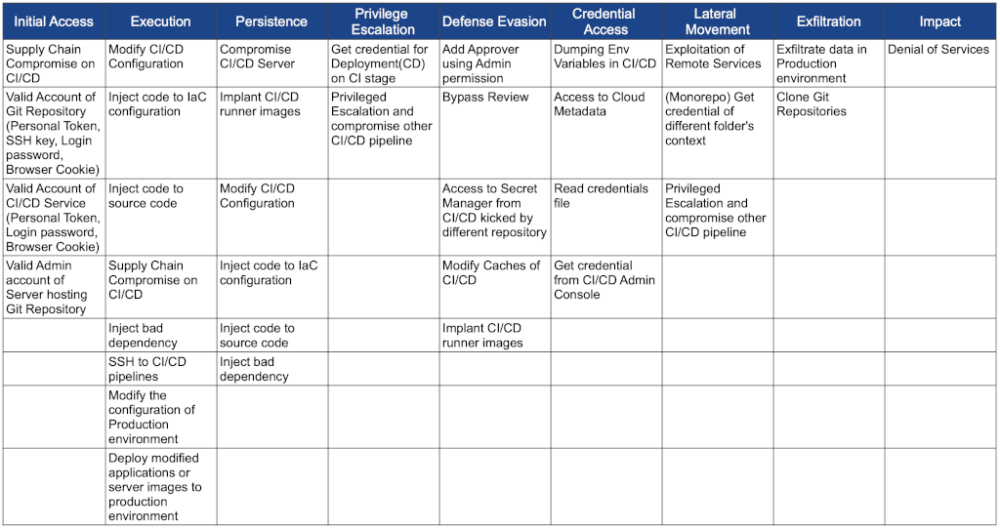

# Threat modelling

Threat modelling is best integrated into the design phase of an SDLC before any code is written. Threat modelling is a structured process of identifying potential security threats and prioritising techniques to mitigate attacks so that data or assets that have been classified as valuable or of higher risk during risk assessment, such as confidential data, are protected. When performed early, it brings a great advantage; potential issues can be found early and solved, saving fixing costs down the line.

There are several tools and methodologies to do threat modelling. 

* If you would like to have a DFD/threat diagram designer, you can use the [Microsoft threat modeling tool](https://www.microsoft.com/en-us/download/details.aspx?id=49168), [OWASP Threat Dragon](https://www.owasp.org/index.php/OWASP_Threat_Dragon), or [Mozilla SeaSponge](http://mozilla.github.io/seasponge/). 
* If you have a small team and would like to do threat modelling via a card game team activity, the [Microsoft EOP card game](https://www.microsoft.com/en-us/sdl/adopt/eop.aspx) and [OWASP Cornucopia](https://www.owasp.org/index.php/OWASP_Cornucopia) are recommended.
* And you can add using threat libraries such as [CAPEC](http://capec.mitre.org/data/definitions/1000.html), [ATT&CK](https://attack.mitre.org/wiki/Main_Page), and [CWE](https://cwe.mitre.org/), which can support threat identification during threat modelling.

## Methods

There are several methods to perform threat modelling. Not all the methods have the same purpose; focus varies from risk, to privacy concerns, to customer. The methods can be combined to understand potential threats better. STRIDE, DREAD, and PASTA fit together really well. Don't let the process or tools limit learning and innovation.

### STRIDE

STRIDE stands for Spoofing, Tampering, Repudiation, Information Disclosure, Denial Of Service, and Elevation/Escalation of Privilege. STRIDE is a widely used threat model developed by Microsoft which evaluates the system's design in a more detailed view. STRIDE can be used to identify threats, including the property violated by the threat and definition. The system's data flow diagram is to be developed in this model, and each node is applied with the STRIDE model. Identifying security threats is a manual process that tools are not supported and should be carried out during the risk assessment. Using data flow diagrams and integrating STRIDE, the system entities, attack surfaces, like known boundaries and attacker events become more identifiable. STRIDE is built upon the CIA triad principle (Confidentiality, Integrity & Availability). Security professionals using STRIDE are looking to answer "What could go wrong with this system?"

| STRIDE threat                     |                                                                                                                                                                                                                                          |
|-----------------------------------|------------------------------------------------------------------------------------------------------------------------------------------------------------------------------------------------------------------------------------------|
| Spoofing                          | Spoofing is an act of impersonation of a user by a malicious actor  which violates the authentication principle from the perspective of  theCIA triad. Common ways include ARP, IP, and DNS spoofing.                              |
| Tampering                         | The modification of information by an unauthorised user. It violates  the integrity principle of the CIA triad.                                                                                                                       |
| Repudiation                       | Not taking responsibility for events where the actions are not  attributed to the attacker, violating the principle of non-repudiability.  For example, the attacker clears up all the logs that could lead to  leaving traces. |
| Information Disclosure            | Information Disclosure is an act of violation of confidentiality of the  CIA triad. A typical example is data breaches.                                                                                                               |
| Denial of Service                 | Denial of Service occurs when an authorised user cannot access  the service, assets, or system due to the exhaustion of network  resources. DoS is a violation of the availability principle of the CIA  triad.                 |
| Elevation/Escalation of Privilege | Escalating privileges to gain unauthorised access is a classic  example of a violation of the authorisation principle of the CIA triad.                                                                                               |

### DREAD

The abbreviation DREAD stands for five questions about each potential: Damage Potential, Reproducibility, Exploitability, Affected Users and Discoverability. DREAD is also a methodology created by Microsoft which can be an add-on to the STRIDE model. It's a model that ranks threats by assigning identified threats according to their severity and priority. In other words, it creates a rating system that is scored based on risk probability. Without STRIDE, the DREAD model also can be used in assessing, analysing and finding the risk probability by threat rating. 

| DREAD potential |                                                                                                                                                                                                                                                                                                                                                                                                                                          |
|-----------------|------------------------------------------------------------------------------------------------------------------------------------------------------------------------------------------------------------------------------------------------------------------------------------------------------------------------------------------------------------------------------------------------------------------------------------------|
| Damage          | Damage refers to the possible damage a threat could cause to the existing  infrastructure or assets. It is based on a scale of 0–10. A  score of 0 means  no harm, 5 means Information Disclosure, 8 means user data is compromised,  9 means internal or administrative data is  compromised, and 10 means  unavailability of a service.                                                                                    |
| Reproducibility | Measures the complexity of the attack. So how easily a hacker can replicate  a threat. A score of 0 means it is nearly impossible to copy, 5  stands for  being complex but possible, 7.5 for an authenticated user  and a score of 10  means the attacker can reproduce very quickly without  any authentication.                                                                                                              |
| Exploitability  | Refers to the attack's sophistication or how easy it would be to launch the  attack. A score of 2.5 implies it would require an advanced skill set of  networking and programming skills; 5 means can be exploited with available  tools, a score of 9 means we would need a simple web application proxy tool  and a score of 10 means it can exploit through a web browser.                                                |
| Affected Users  | Describes the number of users affected by the successful exploitation of a  vulnerability. A score of 0 would mean that there  would be no affected users,  2.5 shall mean for an individual user, 6  would mean a small group of users,  9 would mean significant users like  administrative users, and 10 would imply  all users are affected.                                                                             |
| Discoverability | The process of discovering the vulnerable points in the system. For example,  the threat would be easily found in case of compromise. A score of 0 would  mean it would be challenging to discover it, a score of 5 means that the threat  can be discovered by analysis of HTTP requests, and 8 means it can be  easily found as it's public-facing. A score of 10  would mean it's visible in the  browser address bar. |

### PASTA

PASTA is short for Process for Attack Simulation and Threat Analysis; it is a risk-centric threat modelling framework. PASTA's focus is to align technical requirements with business objectives. PASTA involves the threat modelling process from analysing threats to finding ways to mitigate them, but on a more strategic level and from an attacker's perspective. It identifies the threat, enumerates them, and then assigns them a score. This helps organisations find suitable countermeasures to be deployed to mitigate security threats.

| PASTA Stage                               |                                                                                                                                                                                                                                                                                                                                                                                                                                                                 |
|-------------------------------------------|-----------------------------------------------------------------------------------------------------------------------------------------------------------------------------------------------------------------------------------------------------------------------------------------------------------------------------------------------------------------------------------------------------------------------------------------------------------------|
| Define Objectives                         | The first stage focuses on noting the structure and defining objectives. This makes the end goal a whole lot clearer and ensures the relevant  assets are threat modelled by defining an asset scope.                                                                                                                                                                                                                                                     |
| Define Technical Scope                    | This is where architectural diagrams are defined, both logical and  physical infrastructure. Helpful in mapping the attack surface and  dependencies from the environment.                                                                                                                                                                                                                                                                                |
| Decomposition & Analysis               | Each asset will have a defined trust boundary that encompasses all  its components and data in this stage. For example, mapping threat   vectors for a payment service and evaluating which components  underlying  the service can be leveraged for an attack; components  can be  libraries, dependencies, modules or underlying services etc.                                                                                                    |
| Threat Analysis                           | This refers to the extracted information obtained from threat  intelligence. Useful to identify which applications are vulnerable to   specific vectors; for example, a customer/public-facing application  can  be susceptible to DDOS, unauthorised data alteration etc.                                                                                                                                                                             |
| Vulnerabilities & Weaknesses Analysis  | it analyses the vulnerabilities of web application security  controls.  It identifies security flaws in the application and enumerates   vulnerabilities. It is highly recommended to add mitigation to the  identified threat in this stage. For example, when describing a past  incident involving an exploit of a mail server, lessons learned or  mitigation: lack of thorough testing before implementation and  hardening  the server. |
| Attack/Exploit Enumeration & Modelling | In this stage, we map out the possible threat landscape and the entire  attack surface of our web application. We then map all potential attack  vectors to the different nodes, identifying exploits and attack paths.  This stage simulates all the enumerated information extracted from all  of the previous steps; this helps determine the extent and probability  of successfully launching the identified vulnerabilities.               |
| Risk Impact Analysis                      | Based on the collective data from the previous stages, the scoped   assets that have been affected are analysed and finally, based upon the risk analysis, recommended steps to mitigate the risks and eliminate  the  residual risks are documented.                                                                                                                                                                                                  |

## Example threat matrices

Often, the objective of threat modelling is to discuss the most relevant and high-priority security risks with mitigations. If it is a very large project, and most of
the modules serve similar functions, it may be beneficial to perform the threat modelling with high-risk parts or the one which can mostly represent the business functions.

| Name                   | Tools                                                                                                              |
|------------------------|--------------------------------------------------------------------------------------------------------------------|
| Device                 | Developer Workstation: Mac/Win/Linux/Cloud-based                                                                   |
| Git Repository Service | GitHub, GitLab, Bitbucket, Beanstalk, GitHub, GitLab, SourceForge                                                  |
| CI                     | CI/CD Services like CircleCI, Cloud Build, Codebuild, GitHub Actions, R2Devops                                  |
| CD                     | CI/CD Services like CircleCI, Cloud Build, Codebuild, GitHub Actions, and CD Services like Spinnaker and ArgoCD |
| Secret Management      | Secret Management Services like AWS Secret Manager, GCP Secret Manager, HashiCorp Vault                         |
| Production environment | Cloud Services (AWS, Azure, GCP) and other resources like Container Registry, Linux Server, Kubernetes          |

Recommended modules for threat modelling and code reviewing:

* Modules with security controls such as authentication, authorisation, session management, encryption, data validation, error handling, or logging, administration, and database handlers.
* Legacy modules with vulnerable CVE.
* Modules that may externally interact with unknown users or third-party APIs.
* Modules that handle sensitive information.

## Example threat matrices

### DevOps threat matrix (Microsoft)

### Common threat matrix for CI/CD pipeline (Mercari)

